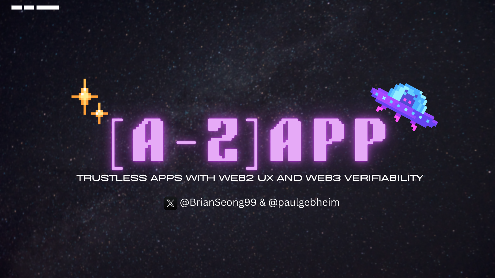

## Introduction: What is an \[A-Z\]app?

Modern web3 applications often force users to confront complexity from the start — wallets, gas fees, bridges, and fragmented UX. Despite technical progress, there's still a tradeoff between speed and trust. \[A-Z\]apps are a new paradigm designed to solve this: apps that feel like Web2 but behave like Web3 under the hood.

An \[A-Z\]app delivers fast, gas-free, seamless user interactions — while guaranteeing trustless execution through configurable cryptographic or decentralized proof systems. Developers can choose their preferred trust model: zero-knowledge proofs (zkVMs), TEEs with attestation, EigenLayer AVS, traditional consensus, or even legal guarantees.

All \[A-Z\]apps connect to a shared multichain infrastructure called **Agglayer**, which provides bridging, settlement, and asset correctness via Pessimistic Proofs and pluggable logic for verification. This allows applications to scale with performance while maintaining the integrity and verifiability expected in Web3.

### **Key Goals of \[A-Z\]apps**

* **Web2-grade UX**: Off-chain execution inside TEEs enables near-instant interactions.
* **Web3-grade Verifiability**: zkVM or AVS layers verify execution logs and enforce correctness.
* **Native Cross-Chain Support**: Built-in Agglayer bridge and messaging for seamless multichain use.
* **No Gas, Optional Wallets at Signup**: Users interact like a normal app; developers can make the app wallet less, where the blockchain stays in the background.

In summary, an \[A-Z\]app aims to feel like a normal web app (fast, user-friendly, no crypto hurdles) while delivering the security guarantees of a decentralized application. It’s a response to the industry’s need for **better UX without sacrificing trustlessness**, leveraging novel architecture to achieve both.

## Motivation & Background

### The Rise of App-Specific Chains

Many major dApps are moving toward their own rollups or chains — Uniswap's Unichain, dYdX, and Coinbase’s Base — to customize UX and escape gas bottlenecks. But running your own L2 comes with infra, liquidity fragmentation, and governance overhead. Application-developers shouldn't need to build and run a whole ecosystem just so they can customize their own UX.

### Performance vs Trust Tradeoffs

Chains like Hyperliquid or early Solana offer blazing speed for niche use cases but sacrifice decentralization or battle-tested security. The result: fast UX, but opaque or fragile trust assumptions.

### The Scalability Trilemma, Revisited

Rollups provide security but still require wallets and gas. Sidechains are cheaper but often centralized. \[A-Z\]apps are designed to combine high performance with modular, verifiable security — and bridge them natively to Ethereum or other hubs via Agglayer.

## How \[A-Z\]apps Work

At the core of an \[A-Z\]app is a layered architecture that decouples fast, user-friendly interaction from trust and verification. Let’s walk through the lifecycle of a user action to understand how these layers work together.

### **Step 1: A Seamless Frontend**

Users interact with \[A-Z\]apps just like they would with any modern web or mobile app — no wallet popups, no gas prompts. The \[A-Z\]app can fill the role of a traditional application backend, and the front-ends can be fit-for-purpose by the developer. No more trying to fit your desired UX into the box created by the blockchain you chose to build with.

### **Step 2: High-Performance Off-Chain Execution**

When a user takes an action — whether it’s placing a trade, initiating a transfer, or updating a game state — the transactions are accepted and the logic is executed off-chain inside a Trusted Execution Environment (TEE). This ensures fast processing and deterministic state updates, all while guaranteeing that the logic ran exactly as expected.

### **Step 3: Configurable Proof of Correctness**

After execution, the app must prove it did the right thing. That’s where verification comes in. Developers can choose from multiple trust layers:

* **zkVMs** like SP1 or RiscZero re-run the logic and produce a succinct proof.
* **AVSs** like EigenLayer use decentralized validators to attest to correctness.
* **TEE attestations** can serve as a lighter-weight guarantee in early stages.
* More traditional consensus or legal models can also be used depending on the app’s needs.

This flexibility lets developers tune the security-performance-cost balance depending on what’s best for their app.

### **Step 4: Confirmation and Bridging via Agglayer**

Once verified, the app’s new state — and any associated token or cross-chain changes — are submitted to the Agglayer. This shared interoperability layer checks the validity using the app’s custom logic, ensures asset balances match expectations using Pessimistic Proofs, and handles cross-chain transfers as needed. This means the applications are not on their own islands, and have a native, fast way to communicate.

### **Step 5: Final Settlement on Layer 1**

Once the Agglayer confirms the validity of execution (via proofs or validator attestations), it finalizes the app state on the base layer — such as Ethereum. This involves submitting the execution proof, balance proofs, and/or pessimistic proofs to the Agglayer's settlement contracts. These contracts verify the data and store the finalized state. From this point, users can safely withdraw funds or trigger further interactions across chains. With Agglayer Fast Interop these interactions can safely occur on connected chains before L1 settlement is complete.

Together, these five layers enable the key promise of \[A-Z\]apps: fast, seamless UX powered by modular trust and multichain coordination — customizable to meet any app's security and performance needs.

* Provides unified bridging for assets/messages
* Verifies proofs via a pluggable per-app logic
* Pessimistic Proofs ensure asset correctness across chains
* Acts as the gateway to Ethereum or other base chains for settlement

## Summary

The user’s assets and state are thus secured by the blockchain, even though the interactions felt as quick as a centralized service. Importantly, the \[A-Z\]app framework is **modular**. The diagram shows that you can plug in different “trust modules” (shown in trust layer boxes) – for instance, swap out the zkVM for a different proving system, or choose between an EigenLayer AVS vs. a local rollup contract for validation. You could even run a **minimalist setup** where you rely heavily on the TEE and a single chain’s security, or a more **robust setup** using decentralized sequencing and validators. This flexibility allows developers to make trade-offs suitable for their needs (e.g., a game might start with a simpler single-chain model, then upgrade to full cross-chain proofs as it grows).

## [zkHyperliquid](https://github.com/BrianSeong99/zkHyperliquid): A Real-World \[A-Z\]app in Action

To demonstrate the \[A-Z\]app paradigm in action, let’s walk through **zkHyperliquid** – a proof-of-concept implementation of a high-performance decentralized exchange using the \[A-Z\]app framework.

[zkHyperliquid](https://github.com/BrianSeong99/zkHyperliquid) is a working proof-of-concept built with the \[A-Z\]app stack — a high-speed trading app that mimics CEX-level UX while maintaining full cryptographic verifiability.

**It’s feature? Use it like a CEX, Trust it like a DEX.**

### **Step 1: Seamless Trading Interface**

Users trade through a fast, intuitive web app — placing orders and seeing instant updates without wallets or gas prompts. They can also deposit USDC from Ethereum or other chains in one click. The Agglayer locks funds on-chain and updates the backend state off-chain.

### **Step 2: Order Execution in a TEE**

The matching engine runs inside a TEE, maintaining a central limit order book (CLOB) and updating user balances off-chain. Orders are matched with sub-second latency, recorded as verifiable logs.

**Note**: Using a TEE introduces a specific trust assumption: you’re relying on the integrity of the underlying hardware and firmware. If the TEE is compromised (e.g., via side-channel attacks or a vulnerability in the enclave), then the system’s guarantees can break down.

To mitigate this, \[A-Z\]apps can use **redundant attestation across multiple TEEs** — e.g., combining Intel SGX, AMD SEV, and ARM-based enclaves — to raise the bar for a successful exploit.

### **Step 3: Zero-Knowledge Verification**

The transaction logs are verified by a zkVM (e.g. SP1), which replays the logic and generates a succinct zk proof that proves all trades followed the correct logic and constraints.

### **Step 4: Agglayer Confirmation**

The proof is submitted to Agglayer, which verifies it through the app's custom logic. If valid, users can withdraw updated balances on-chain — trustlessly and cross-chain.

### **Step 5: Final On-Chain Settlement**

Agglayer submits final balance and state proofs to Ethereum for settlement. From this point, the trades are fully finalized on-chain, closing the loop from UX to verifiability.

zkHyperliquid shows how \[A-Z\]apps eliminate the tradeoff between speed and trust — no custom chain required, no validators to run, and yet every user interaction is provable.

## Key Benefits of \[a-z\]apps

\[A-Z\]apps deliver meaningful advantages by combining speed, usability, and verifiability:

* **Web2-Grade UX with Web3-Grade Security**: Apps run with instant, gas-free interactions. Users aren’t burdened with wallets or tokens at the start, yet every interaction is cryptographically provable.
* **Trustless Execution**: All off-chain computation is verified via zero-knowledge proofs, decentralized attestations (like EigenLayer AVS), or TEE attestations — ensuring correctness without relying on app operators.
* **Modular Trust Models**: Developers can choose how their app is verified — from fully trustless zkVMs, to fast semi-trusted TEEs, to hybrid consensus schemes. This makes \[A-Z\]apps adaptable to the evolving needs of any project.
* **Cross-Chain Interoperability by Default**: Through Agglayer, \[A-Z\]apps support native multichain bridging, asset portability, and state proofs across ecosystems without relying on third-party bridges.
* **No Custom Blockchain Overhead**: Unlike app-chains or rollups, \[A-Z\]apps don’t require running new infra, issuing tokens, or building validator sets. They launch like traditional web apps, but with embedded verifiability.
* **Frictionless Onboarding**: With one-click access and embedded key management, users can begin using the app immediately — and opt into self-custody as needed — removing the biggest barrier to Web3 adoption.

## Future Outlook

As the ecosystem evolves, \[A-Z\]apps will become even more powerful and accessible. Key areas of growth include:

* **Ecosystem Expansion**: We expect \[A-Z\]apps across sectors — DeFi, gaming, social — to compose off-chain services, share infrastructure like Agglayer, and interoperate via standardized messages.
* **Improved Developer Tooling**: Future releases may offer drag-and-drop interfaces for configuring trust models, deploying zkVMs, and integrating DA or bridge modules — dramatically simplifying development.
* **Advanced Features and Privacy**: With programmable ZK circuits, \[A-Z\]apps can add confidentiality for user data or app logic while keeping verifiability. This unlocks private auctions, games, or messaging use cases.
* **Standardization Across the Stack**: Defining open standards for transaction logs, proof formats, and bridge messaging will allow wallets, explorers, and protocols to seamlessly support \[A-Z\]apps out of the box.

## Conclusion
In conclusion, the \[A-Z\]app paradigm represents an exciting evolution in building decentralized applications. By rethinking the stack with user experience as a first-class citizen and leveraging the latest in trustless technology, it offers a path to break the compromise between UX and security. Developers can deliver apps that feel as slick as modern web2 apps, while users gain the assurance that **“don’t trust, verify”** is always in effect behind the scenes. As the framework matures, we may well see an explosion of innovative \[A-Z\]apps that bring Web3 to the masses in a truly seamless way. The journey is just beginning, and it points toward a future where *every* app, from A to Z, can be trustless by design – without anyone even noticing the magic that makes it possible.

## Acknowledgements
Thanks to Brian Seong (@BrianSeong99) for the hard work composing this post, along with countless hours talking to Brendan Farmer (@\_bpfarmer) and David Silverman (@davidesilverman) and tons of other people at Polygon.

See Brian's version of this post on [his blog](https://brianseong.ghost.io/azapps).
